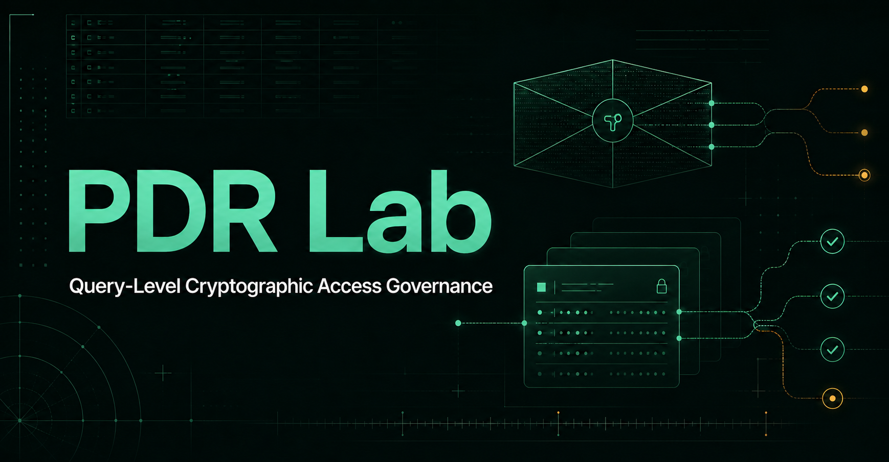
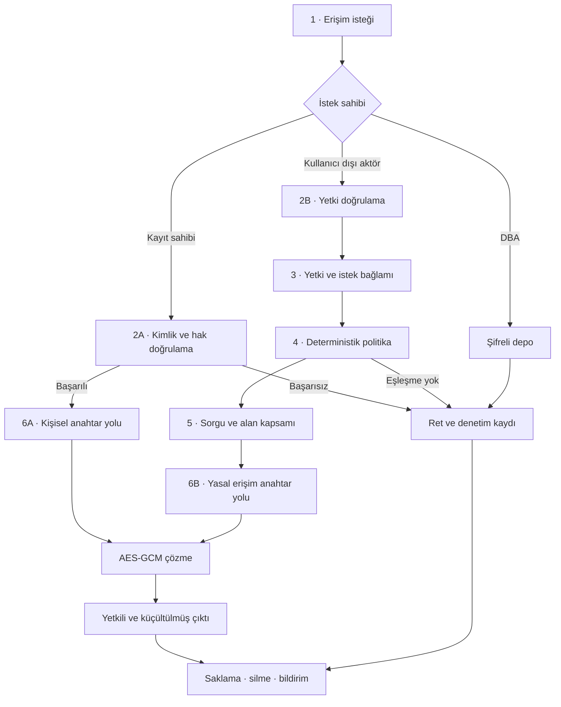

# PDR Lab — Kriptografik Erişim Yönetişimi

[](https://github.com/Esatsy/pdr-lab-10/actions/workflows/pages.yml)


PDR Lab, kişisel veri kayıtlarına erişimin yalnızca veritabanı rolüne göre değil; **kimlik, hak sahipliği, yasal yetki, amaç, süre ve talep edilen alan kapsamına** göre değerlendirilmesini gösteren etkileşimli bir araştırma laboratuvarıdır.

Uygulama, makaledeki akışı iki ayrı anahtar yolu üzerinden canlandırır: kayıt sahibinin kişisel erişimi ve yetkili kurumun sorgu-kapsamlı yasal erişimi. Tüm kayıtlar sentetiktir; kriptografik işlemler tarayıcıdaki Web Crypto API ile gerçekleştirilir.

## Canlı uygulama

- [GitHub Pages sürümü](https://esatsy.github.io/pdr-lab-10/)



## Laboratuvar neyi gösteriyor?

- PDR-A, PDR-B, PDR-C ve PDR-D sınıflarında dört sentetik kayıt.
- Kişisel, yasal ve DBA erişim yollarının birbirinden ayrılması.
- Her kayıt için AES-GCM veri şifreleme anahtarı (DEK).
- Aynı DEK'in kişisel ve yasal erişim için iki ayrı RSA-OAEP anahtarıyla sarılması.
- Yasal sorgularda alan düzeyinde veri küçültme.
- Onay, daraltma ve ret kararlarının gerekçeli biçimde gösterilmesi.
- Zincirlenmiş denetim kayıtları ve manipülasyon testi.
- RQ1/RQ2 kapsamını ölçen sekiz çalıştırılabilir doğrulama senaryosu.
- Türkçe ve İngilizce arayüz desteği.

## Makaledeki erişim akışı



Kişisel yol, doğrulanmış kayıt sahibini doğrudan kişisel anahtar işlemine taşır. Kullanıcı dışı yol ise özel anahtar işleminden önce yetki, amaç, yasal dayanak, süre ve alan kapsamını denetler. DBA rolü şifreli depoyu yönetebilir; ancak bu teknik ayrıcalık özel anahtar çağırma veya açık metin okuma yetkisi vermez.

## Karar motoru

Karar motoru deterministiktir. Aynı kayıt ve aynı istek bağlamı her çalıştırmada aynı yetkilendirme sonucunu üretir.

| Yol | Kontrol | İzin verilen kapsam |
|---|---|---|
| Kişisel | Kayıt PDR-A/kişisel olmalı ve kimlik-hak doğrulaması başarılı olmalı | Kaydın tüm alanları |
| Kolluk / Savcılık | PDR-B + `Soruşturma kapsamı` | Abone kimliği, hücre bölgesi, zaman aralığı |
| Mali Suçları Araştırma Birimi | PDR-C + `Şüpheli işlem analizi` | İşlem kimliği, taraflar, tutar, tarih |
| Finansal Düzenleme Kurumu | PDR-D + `Dolandırıcılık örüntüsü analizi` | Risk skoru ve örüntü |
| Kamu Sağlığı Kurumu | PDR-A + `Bulaşıcı hastalık izlemi` | Tanı ve ziyaret tarihi |
| DBA | Teknik rol hiçbir özel anahtar yolunu açmaz | Açık metin yok |

Yasal erişimde ayrıca yasal dayanak boş bırakılamaz ve istek süresi **72 saati aşamaz**.

- İstenen alanların tamamı izinliyse sonuç **ONAYLANDI** olur.
- İzinli ve izinsiz alanlar birlikte istenirse yalnızca izinli alanlar döner; sonuç **DARALTILDI** olur.
- Kimlik/hak, yetki-amaç eşleşmesi, yasal dayanak veya süre kontrolü başarısızsa sonuç **REDDEDİLDİ** olur ve şifre çözme işlemi başlamaz.

## Kriptografik model

```text
Kayıt → rastgele AES-GCM DEK → şifreli veri
                         ├── RSA-OAEP / kişisel açık anahtar → kişisel sarılı DEK
                         └── RSA-OAEP / yasal açık anahtar   → yasal sarılı DEK
```

Başarılı kararın ardından yalnızca seçilen erişim yolunun özel anahtarı DEK'i açar. Veri AES-GCM ile çözülür ve karar motorunun izin verdiği alanlarla sınırlandırılır. Anahtarlar yalnızca tarayıcı belleğinde oluşturulur; uygulamada gerçek kişi verisi veya kalıcı özel anahtar bulunmaz.

## Doğrulama senaryoları

| ID | Senaryo | Beklenen sonuç |
|---|---|---|
| T1 | DBA doğrudan açık metin denemesi | Ret; açık metin sızıntısı yok |
| T2 | Geçerli kişisel erişim | Kişisel anahtar yoluyla tam yetkili çıktı |
| T3 | Geçerli yasal sorgu | Yasal anahtar yoluyla dört izinli alan |
| T4 | Fazla alan talebi | Talep daraltılır, fazla alan dışlanır |
| T5 | Geçersiz yetki / amaç | Politika reddi; kriptografik çağrı yok |
| T6 | Çok taraflı kayıt | Sorgu kapsamına uygun küçültülmüş çıktı |
| T7 | Veri füzyonu | Yalnızca risk skoru ve örüntü |
| T8 | Denetim kaydı manipülasyonu | Hash zinciri bütünlük hatasını yakalar |

## Yerelde çalıştırma

Gereksinimler: Node.js `22.13.0` veya üzeri ve npm.

```bash
git clone https://github.com/Esatsy/pdr-lab-10.git
cd pdr-lab-10
npm ci
npm run dev
```

Üretim derlemeleri:

```bash
npm run build
```

GitHub Pages çıktısı `dist/` klasöründe oluşturulur.

## Proje yapısı

```text
app/page.tsx                 Laboratuvar, karar motoru ve doğrulama senaryoları
app/globals.css              Tema ve uygulamaya özel stiller
components/ui/               Yeniden kullanılabilir arayüz bileşenleri
main.tsx                     React uygulama giriş noktası
vite.config.ts               Vite ve GitHub Pages derleme ayarları
.github/workflows/pages.yml  Otomatik Pages dağıtımı
```

## Yayınlama

`main` dalına yapılan her gönderim, GitHub Actions üzerinden statik Pages derlemesini üretir ve yayımlar.

## Sınırlamalar

Bu proje akademik kavramları görünür kılan bir **eğitim ve doğrulama prototipidir**. Üretim ortamı için HSM/KMS anahtar yönetimi, kurumsal kimlik doğrulama, güvenilir politika deposu, sunucu tarafı denetim altyapısı ve mevzuata özgü kontroller ayrıca uygulanmalıdır.
