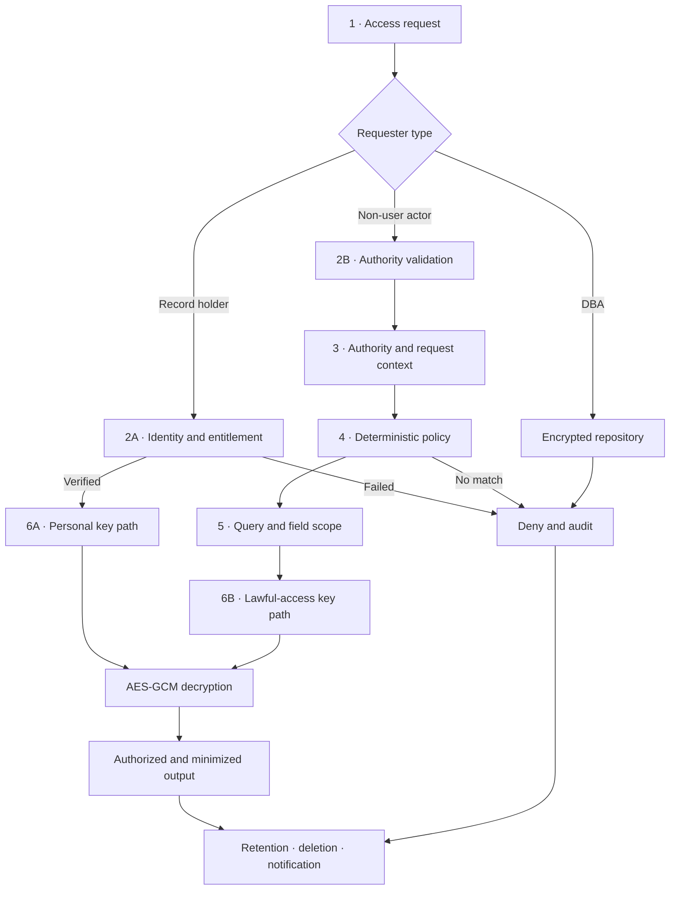

# PDR Lab — Cryptographic Access Governance

[](https://github.com/Esatsy/pdr-lab-10/actions/workflows/pages.yml)


PDR Lab is an interactive research environment demonstrating how access to personal data records can be governed by **identity, entitlement, legal authority, purpose, duration, and requested field scope**—not merely by a database role.

The laboratory implements two distinct cryptographic access paths from the paper's flow: personal access by the record holder and query-scoped lawful access by an authorized institution. All records are synthetic, and cryptographic operations run locally in the browser through the Web Crypto API.

## Live demo

[Launch PDR Lab on GitHub Pages](https://esatsy.github.io/pdr-lab-10/)


The interface opens in English. Turkish remains available from the `EN / TR` language control, and the selected preference is retained in the browser.

## What the lab demonstrates

- Four synthetic records across the PDR-A, PDR-B, PDR-C, and PDR-D classes.
- Separate personal, lawful, and database-administrator access paths.
- A randomly generated AES-GCM data-encryption key (DEK) for every record.
- Dual RSA-OAEP wrapping of each DEK for personal and lawful access.
- Field-level data minimization for lawful queries.
- Explainable `APPROVED`, `NARROWED`, and `DENIED` decisions.
- Hash-chained audit records with an integrity-tampering test.
- Eight executable validation scenarios covering RQ1 and RQ2.
- English-first bilingual interface with Turkish support.

## Access flow



The personal path takes a verified record holder directly to the personal key operation. The non-user path evaluates authority, purpose, legal basis, duration, and field scope before a lawful private-key operation becomes available. A DBA may administer encrypted storage but cannot invoke either private key or read plaintext.

## Decision engine

The decision engine is deterministic: the same record and request context always produce the same authorization result.

| Path | Required match | Maximum released scope |
|---|---|---|
| Personal | Personal record and verified identity/entitlement | All record fields |
| Law enforcement / Prosecutor | PDR-B + `Investigation scope` | Subscriber ID, cell area, time range |
| Financial Intelligence Unit | PDR-C + `Suspicious transaction analysis` | Transaction ID, parties, amount, date |
| Financial regulator | PDR-D + `Fraud-pattern analysis` | Risk score and pattern |
| Public-health authority | PDR-A + `Infectious-disease monitoring` | Diagnosis and visit date |
| DBA | Technical role never opens a private-key path | No plaintext |

Lawful access also requires a non-empty legal or institutional basis and an authorization duration of no more than **72 hours**.

- If every requested field is permitted, the request is **APPROVED**.
- If permitted and excessive fields are mixed, only permitted fields are returned and the request is **NARROWED**.
- If identity, entitlement, authority-purpose matching, legal basis, or duration validation fails, the request is **DENIED** before decryption begins.

## Cryptographic model

```text
Record → random AES-GCM DEK → encrypted payload
                         ├── RSA-OAEP / personal public key → personal-wrapped DEK
                         └── RSA-OAEP / lawful public key   → lawful-wrapped DEK
```

After a successful decision, only the private key belonging to the selected access path unwraps the DEK. The payload is decrypted with AES-GCM and filtered to the fields authorized by policy. Keys exist only in browser memory; the application contains no real personal data or persistent private keys.

## Validation scenarios

| ID | Scenario | Expected result |
|---|---|---|
| T1 | DBA direct plaintext attempt | Denied; no plaintext leakage |
| T2 | Valid personal access | Fully authorized output through the personal key path |
| T3 | Valid lawful query | Four authorized fields through the lawful key path |
| T4 | Excess-field request | Request narrowed; excessive field excluded |
| T5 | Invalid authority or purpose | Policy denial; no cryptographic call |
| T6 | Multi-party record | Query-scoped minimized output |
| T7 | Data-fusion scenario | Risk score and pattern only |
| T8 | Audit-record manipulation | Hash-chain integrity failure detected |

## Run locally

Requirements: Node.js `22.13.0` or later and npm.

```bash
git clone https://github.com/Esatsy/pdr-lab-10.git
cd pdr-lab-10
npm ci
npm run dev
```

Create a production build:

```bash
npm run build
```

The static output is written to `dist/`.

## Project structure

```text
app/page.tsx                 Lab, decision engine, and validation scenarios
app/globals.css              Theme and application-specific styles
components/ui/               Reusable interface components
main.tsx                     React application entry point
vite.config.ts               Vite and GitHub Pages build configuration
.github/workflows/pages.yml  Automated GitHub Pages deployment
```

## Deployment

Every push to `main` builds the static application and deploys it to GitHub Pages through GitHub Actions.

## Limitations

This project is an **educational and validation prototype**. A production implementation would additionally require HSM/KMS-backed key management, institutional identity integration, a trusted policy store, server-side audit infrastructure, and jurisdiction-specific compliance controls.

---

## Türkçe özet

PDR Lab; kişisel veri kayıtlarına erişimin kimlik, hak sahipliği, yasal yetki, amaç, süre ve talep edilen alan kapsamına göre değerlendirilmesini gösteren etkileşimli bir araştırma laboratuvarıdır.

Laboratuvar; kişisel ve yasal erişim için iki ayrı RSA-OAEP anahtar yolu, AES-GCM ile şifrelenmiş sentetik kayıtlar, alan düzeyinde veri küçültme, açıklanabilir kararlar, zincirlenmiş denetim kayıtları ve sekiz doğrulama senaryosu içerir. Arayüz varsayılan olarak İngilizce açılır; `EN / TR` seçicisinden Türkçeye geçilebilir.

[Canlı uygulamayı açın](https://esatsy.github.io/pdr-lab-10/)
